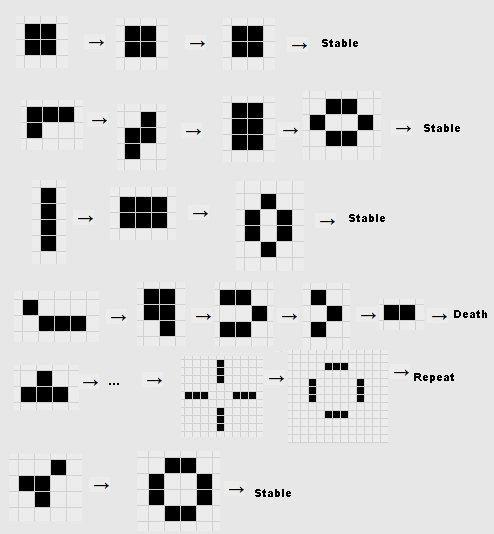

### Conway's Game of Life

A customizable MATLAB implementation of **Conway's Game of Life**, the classic cellular automaton devised by mathematician John Horton Conway in 1970.

**Features:**

* 🎨 Customizable simulation appearance
* 📐 Adjustable grid size
* ⚡ Adjustable simulation speed
* 📊 Tracks cell births and deaths
* ⏱️ Records simulation timing
* 📝 Automatically logs results to `GOL_Log.txt`

**Rules of the game:**

  1. Any live cell with fewer than two live neighbours dies, as if by underpopulation.
  2. Any live cell with two or three live neighbours lives on to the next generation.
  3. Any live cell with more than three live neighbours dies, as if by overpopulation.
  4. Any dead cell with exactly three live neighbours becomes a live cell, as if by reproduction.

**Patterns:**

The created cell "patterns" can be categorized according to the complexity of their behavior, from simple unchanging ‘still lives’ to emulations of universal Turing machines. See the [Game of Life Lab](https://www.gameoflifelab.com/patterns) for more! Here are some examples of the more simple patterns which you can render in this simulation:

